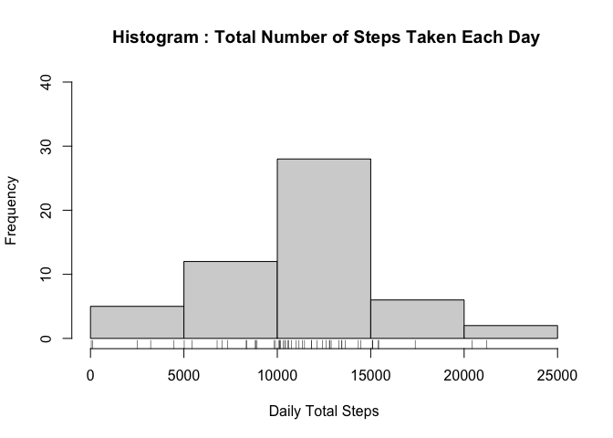
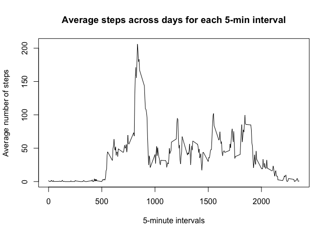
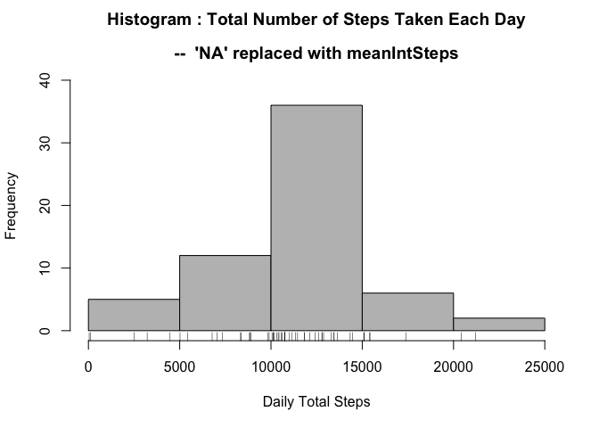
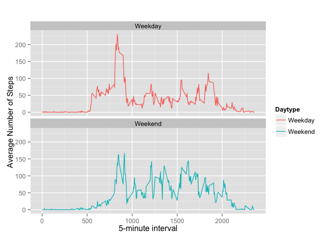
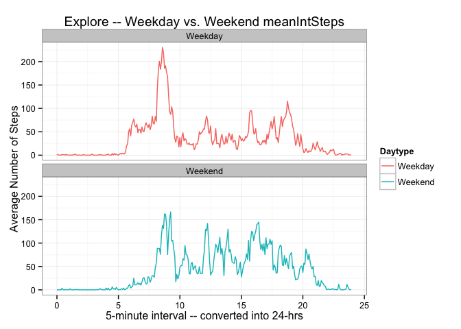
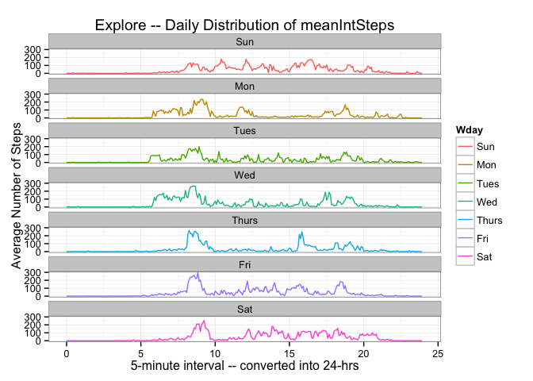

# Reproducible Research: Peer Assessment 1

*coded by H-RM TAN 10-13Nov2015*  

### §0 Set environment 
##### **0.1 Load Libraries**  

```r
library(knitr)
library(graphics)
library(ggplot2)
library(lubridate)
library(dplyr)
```

```
## 
## Attaching package: 'dplyr'
## 
## The following objects are masked from 'package:lubridate':
## 
##     intersect, setdiff, union
## 
## The following objects are masked from 'package:stats':
## 
##     filter, lag
## 
## The following objects are masked from 'package:base':
## 
##     intersect, setdiff, setequal, union
```

### §1 Loading and preprocessing the data
This code assumes that activity.csv file is in the current directory. However if the file is not found in the current working directory, the code will download the zip file from the URL, unzip it in a temporary folder, and read it to environment.  

##### **1.1 Load Data**  

```r
## --- DOWNLOAD FILE & UNZIP  
if (!file.exists("activity.csv") ) {
      fileurl <- "https://d396qusza40orc.cloudfront.net/repdata%2Fdata%2Factivity.zip"
      tmp<-tempfile()
      download.file(fileurl, tmp, method="curl", mode="wb")
      activity <- read.csv(unzip(tmp, "activity.csv"))
      unlink(tmp)
}

## --- READ FILE  
if(file.exists("activity.csv")){
      activity <- read.csv("./activity.csv")
}
```

##### **1.1.1 Browse Data**  

```r
head(activity)
```

```
##   steps       date interval
## 1    NA 2012-10-01        0
## 2    NA 2012-10-01        5
## 3    NA 2012-10-01       10
## 4    NA 2012-10-01       15
## 5    NA 2012-10-01       20
## 6    NA 2012-10-01       25
```

```r
str(activity)
```

```
## 'data.frame':	17568 obs. of  3 variables:
##  $ steps   : int  NA NA NA NA NA NA NA NA NA NA ...
##  $ date    : Factor w/ 61 levels "2012-10-01","2012-10-02",..: 1 1 1 1 1 1 1 1 1 1 ...
##  $ interval: int  0 5 10 15 20 25 30 35 40 45 ...
```
<!-- ##### 1.2 PREPROCESS DATA  -->

### §2 What is the mean total number of steps taken per day?  
##### **For this part of the assignment, you can ignore the missing values in the dataset.**  
##### **2.1 Calculate the total number of steps taken per day.**  

```r
## Calculate total steps for each day
DailyTotal <- activity %>% group_by(date) %>% summarise_each(funs(sum), -date:-interval )
```


```r
## Browse & check
DailyTotal
```

```
## Source: local data frame [61 x 2]
## 
##          date steps
##        (fctr) (int)
## 1  2012-10-01    NA
## 2  2012-10-02   126
## 3  2012-10-03 11352
## 4  2012-10-04 12116
## 5  2012-10-05 13294
## 6  2012-10-06 15420
## 7  2012-10-07 11015
## 8  2012-10-08    NA
## 9  2012-10-09 12811
## 10 2012-10-10  9900
## ..        ...   ...
```

##### **2.2 Make a histogram of the total number of steps taken each day.**  

```r
hist(DailyTotal$steps,
     main = " Histogram : Total Number of Steps Taken Each Day", 
     xlab = "Daily Total Steps", 
     ylim = c(0, 40) , col = "light grey")

rug(DailyTotal$steps)
```

 

##### **2.3 Calculate and report the mean and median of the total number of steps taken per day.**  

```r
## Mean
mean(DailyTotal$steps, na.rm = TRUE) 
```

```
## [1] 10766.19
```

```r
## Median
median(DailyTotal$steps, na.rm = TRUE) 
```

```
## [1] 10765
```
*Mean and Median total number of steps taken per day are 10766.19 and 10765 respectively.*  


```r
## check summary
summary(DailyTotal)
```

```
##          date        steps      
##  2012-10-01: 1   Min.   :   41  
##  2012-10-02: 1   1st Qu.: 8841  
##  2012-10-03: 1   Median :10765  
##  2012-10-04: 1   Mean   :10766  
##  2012-10-05: 1   3rd Qu.:13294  
##  2012-10-06: 1   Max.   :21194  
##  (Other)   :55   NA's   :8
```

### §3 What is the average daily activity pattern?
##### **3.1 Make a time series plot (i.e. type = "l") of the 5-minute interval (x-axis) and the average number of steps taken, averaged across all days (y-axis)**  


```r
## Calculate Mean number of Steps for each interval averaged across all days
meanIntSteps <- activity %>% group_by(interval) %>% summarise_each(funs(mean(., na.rm = TRUE)), -date) 
```

```r
## Browse & check
meanIntSteps
```

```
## Source: local data frame [288 x 2]
## 
##    interval     steps
##       (int)     (dbl)
## 1         0 1.7169811
## 2         5 0.3396226
## 3        10 0.1320755
## 4        15 0.1509434
## 5        20 0.0754717
## 6        25 2.0943396
## 7        30 0.5283019
## 8        35 0.8679245
## 9        40 0.0000000
## 10       45 1.4716981
## ..      ...       ...
```


```r
## Plot average daily activity
with(meanIntSteps, 
     plot.ts(interval, steps, type="l", 
             xlab="5-minute intervals", 
             ylab="Average number of steps", 
             main="Average steps across days for each 5-min interval") )
```

 

#####**3.2 Which 5-minute interval, on average across all the days in the dataset, contains the maximum number of steps?**

```r
# max(meanIntSteps$steps) # [1] 206.1698
# which.max(meanIntSteps$steps) # [1] 104
meanIntSteps[which.max(meanIntSteps$steps),] 
```

```
## Source: local data frame [1 x 2]
## 
##   interval    steps
##      (int)    (dbl)
## 1      835 206.1698
```

*The 835th 5-minute interval contains the maximum number of steps.*  

### §4 Imputing missing values
#####**4.1 Calculate and report the total number of missing values in the dataset (i.e. the total number of rows with NAs)**


```r
sum(is.na(activity))
```

```
## [1] 2304
```
*There are 2304 (rows of) missing values.*  


#####**4.2 Devise a strategy for filling in all of the missing values in the dataset. The strategy does not need to be sophisticated. For example, you could use the mean/median for that day, or the mean for that 5-minute interval, etc.**

*5-minute intervals' missing values will be replaced with the corresponding mean of 5-minute interval (averaged across days).*   


#####**4.3 Create a new dataset that is equal to the original dataset but with the missing data filled in.**


```r
## Create new dataFrame
activity2 <- activity

## Find the Dates with missing steps
NAdates <- unique(activity[which(is.na(activity)),"date"])

## Substituting NAdates' NAs with meanIntSteps$steps
for(n in NAdates){
      activity2[which(activity2$date == n), "steps"] <-  meanIntSteps$steps
}  
```

```r
## Browse New dataFrame
head(activity2)
```

```
##       steps       date interval
## 1 1.7169811 2012-10-01        0
## 2 0.3396226 2012-10-01        5
## 3 0.1320755 2012-10-01       10
## 4 0.1509434 2012-10-01       15
## 5 0.0754717 2012-10-01       20
## 6 2.0943396 2012-10-01       25
```
##### **4.3.1 Compare Original & New Data**  

```r
## Original
str(activity)
```

```
## 'data.frame':	17568 obs. of  3 variables:
##  $ steps   : int  NA NA NA NA NA NA NA NA NA NA ...
##  $ date    : Factor w/ 61 levels "2012-10-01","2012-10-02",..: 1 1 1 1 1 1 1 1 1 1 ...
##  $ interval: int  0 5 10 15 20 25 30 35 40 45 ...
```

```r
## New
str(activity2)
```

```
## 'data.frame':	17568 obs. of  3 variables:
##  $ steps   : num  1.717 0.3396 0.1321 0.1509 0.0755 ...
##  $ date    : Factor w/ 61 levels "2012-10-01","2012-10-02",..: 1 1 1 1 1 1 1 1 1 1 ...
##  $ interval: int  0 5 10 15 20 25 30 35 40 45 ...
```

##### **4.4 Make a histogram of the total number of steps taken each day...**  

```r
## Recalculate Daily total steps for new dataframe
DailyTotal2 <- activity2 %>% group_by(date) %>% summarise_each(funs(sum), -date:-interval )

## Make Histogram of this updated daily total number of steps 
hist(DailyTotal2$steps, 
     main = list(c(" Histogram : Total Number of Steps Taken Each Day ",
                   " ","--  'NA' replaced with meanIntSteps")),
     xlab = "Daily Total Steps", 
     ylim = c(0, 40) , col = "grey")

rug(DailyTotal2$steps)
```

 

##### **4.5 Calculate and report the mean and median total number of steps taken per day.**  

```r
## Mean
mean(DailyTotal2$steps, na.rm = TRUE) 
```

```
## [1] 10766.19
```

```r
## Median
median(DailyTotal2$steps, na.rm = TRUE) 
```

```
## [1] 10766.19
```

```r
## Check summary
summary(DailyTotal2)
```

```
##          date        steps      
##  2012-10-01: 1   Min.   :   41  
##  2012-10-02: 1   1st Qu.: 9819  
##  2012-10-03: 1   Median :10766  
##  2012-10-04: 1   Mean   :10766  
##  2012-10-05: 1   3rd Qu.:12811  
##  2012-10-06: 1   Max.   :21194  
##  (Other)   :55
```

##### **4.5.1 Do these values differ from the estimates from the first part of the assignment?** 
*The mean remains the same while median now equals mean, whereas previously median was less than mean.*  

##### **4.5.2 What is the impact of imputing missing data on the estimates of the total daily number of steps?**
*Substituting missing values (with mean interval steps) has increased the median of total number of steps.*   

### §5 Are there differences in activity patterns between weekdays and weekends?
##### **For this part the weekdays() function may be of some help here. Use the dataset with the filled-in missing values for this part.**

##### **5.1 Create a new factor variable in the dataset with two levels – “weekday” and “weekend” indicating whether a given date is a weekday or weekend day.**


```r
## Create a Day of the Week variable
activity2 <- mutate(activity2, Wday =  wday(activity2$date,label = TRUE))

## Daytype Labels
DaytypeL <- c("Weekday","Weekend")

## Re-categorize days of the week into Weekday/Weekend and insert as new variable
activity2 <- mutate(activity2, 
                    Daytype = as.factor(DaytypeL[as.numeric(activity2$Wday=="Sun" | activity2$Wday=="Sat")+1])  ) 
```

##### **5.1.1 Check & browse**  

```r
## check&browse  
head(activity2)
```

```
##       steps       date interval Wday Daytype
## 1 1.7169811 2012-10-01        0  Mon Weekday
## 2 0.3396226 2012-10-01        5  Mon Weekday
## 3 0.1320755 2012-10-01       10  Mon Weekday
## 4 0.1509434 2012-10-01       15  Mon Weekday
## 5 0.0754717 2012-10-01       20  Mon Weekday
## 6 2.0943396 2012-10-01       25  Mon Weekday
```

```r
str(activity2)
```

```
## 'data.frame':	17568 obs. of  5 variables:
##  $ steps   : num  1.717 0.3396 0.1321 0.1509 0.0755 ...
##  $ date    : Factor w/ 61 levels "2012-10-01","2012-10-02",..: 1 1 1 1 1 1 1 1 1 1 ...
##  $ interval: int  0 5 10 15 20 25 30 35 40 45 ...
##  $ Wday    : Ord.factor w/ 7 levels "Sun"<"Mon"<"Tues"<..: 2 2 2 2 2 2 2 2 2 2 ...
##  $ Daytype : Factor w/ 2 levels "Weekday","Weekend": 1 1 1 1 1 1 1 1 1 1 ...
```

##### **5.2 Make a panel plot containing a time series plot (i.e. type = "l") of the 5-minute interval (x-axis) and the average number of steps taken, averaged across all weekday days or weekend days (y-axis). See the README file in the GitHub repository to see an example of what this plot should look like using simulated data.**  


```r
## Calculate mean interval steps by Daytype  
meanIntSteps2 <- activity2 %>% group_by(interval, Daytype) %>% 
      summarise_each(funs(mean(., na.rm = TRUE)), -date,-Wday) 

## QuickPlot the mean interval steps for weekday and weekend
qplot(interval, steps, data=meanIntSteps2, geom="line", 
      xlim=c(-10, max(meanIntSteps2$interval)+10), 
      xlab = "5-minute interval", 
      ylab = "Average Number of Steps", 
      main = "", 
      color = Daytype) + facet_wrap(~ Daytype, ncol = 1 )  
```

 

*There is generally a rather abrupt increase (~500th and ~800th 5-min interval) and higher peak number of steps in the earlier part of the weekday relative to the weekends. The high peak number of steps  drops dramatically just before ~1000th 5-min interval for both weekdays and weekends. However, a higher number of steps during the middle part of the day was observed in the weekends compared to weekdays. There is a sharper decline in number of steps towards the end of a weekday (before ~2000th 5-min interval) while this decline in number of steps occurs more gradually on the weekends.*  

------------------------  

### §6 Further Personal Exploration of Data ----
##### **6.1 Further exploration for describing observed differences between weekday and weekend:**    


```r
## Convert 5-min Interval bins into 24hr time-bins
IntTime0 <- seq(0, 24, by = 1/60*5) 
IntTime <- IntTime0[1:(length(IntTime0)-1)] 

## Add this 24-hr 5-min interval to activity2
activity2 <- cbind(activity2, IntTime )
activity2 <- activity2[, c("steps", "date", "interval", "IntTime", "Wday", "Daytype")]
```

```r
## Check
head(activity2)
```

```
##       steps       date interval    IntTime Wday Daytype
## 1 1.7169811 2012-10-01        0 0.00000000  Mon Weekday
## 2 0.3396226 2012-10-01        5 0.08333333  Mon Weekday
## 3 0.1320755 2012-10-01       10 0.16666667  Mon Weekday
## 4 0.1509434 2012-10-01       15 0.25000000  Mon Weekday
## 5 0.0754717 2012-10-01       20 0.33333333  Mon Weekday
## 6 2.0943396 2012-10-01       25 0.41666667  Mon Weekday
```

```r
## Recalculate meanIntSteps using updated activity2 dataframe  
meanIntSteps3 <- activity2 %>% group_by(IntTime, Daytype) %>% 
      summarise_each(funs(mean(., na.rm = TRUE)), -date,-Wday)

## QuickPlot meanIntSteps3 using the 24-hr 5-min intervals
qplot(IntTime, steps, data=meanIntSteps3, geom="line", 
      xlim=c(0, 24), xlab = "5-minute interval -- converted into 24-hrs", 
      ylab = "Average Number of Steps", 
      main = "Explore -- Weekday vs. Weekend meanIntSteps",
      color = Daytype) + facet_wrap(~ Daytype, ncol = 1 ) + theme_bw()
```

 

*Now it is easier to appreciate what is going on during the weekday and weekend. Number of steps starts to increase around 5--7am and peaking around 9am during the weekday. It then subsides until around lunch time and tea-time before rising around 5-6pm and dipping prior to another peak around 7pm. Subsequently, the number of steps decreases rapidly. On the weekend there is a later rise to peak number of steps in the morning, and a lot more activity during the day which slowly decreases from about 4pm towards 9pm.*  
*[Observed that the lines seem 'smoother' -- most likely due to the (decimal) 24-hr intervals cf. original 5-min (integer) intervals]*    

##### **6.2 Further exploration on possible differences in mean number of steps across (each day of) the week:**  


```r
## Calculate mean number of steps for each 5-min interval grouped by each day of the week
meanIntSteps4 <- activity2 %>% group_by(interval, Wday) %>% 
      summarise_each(funs(mean(., na.rm = TRUE)), -date,-Daytype)

## QuickPlot meanIntSteps4 using the 24-hr 5-min intervals
qplot(IntTime, steps, data=meanIntSteps4, geom="line", 
      xlim=c(0, 24), xlab = "5-minute interval -- converted into 24-hrs", 
      ylab = "Average Number of Steps", 
      main = "Explore -- Daily Distribution of meanIntSteps", 
      color = Wday) + facet_wrap(~ Wday, ncol = 1 ) + theme_bw()
```

 

*Now we see the slight variations in the number of steps across each day of the week! =)*  

------------------------


